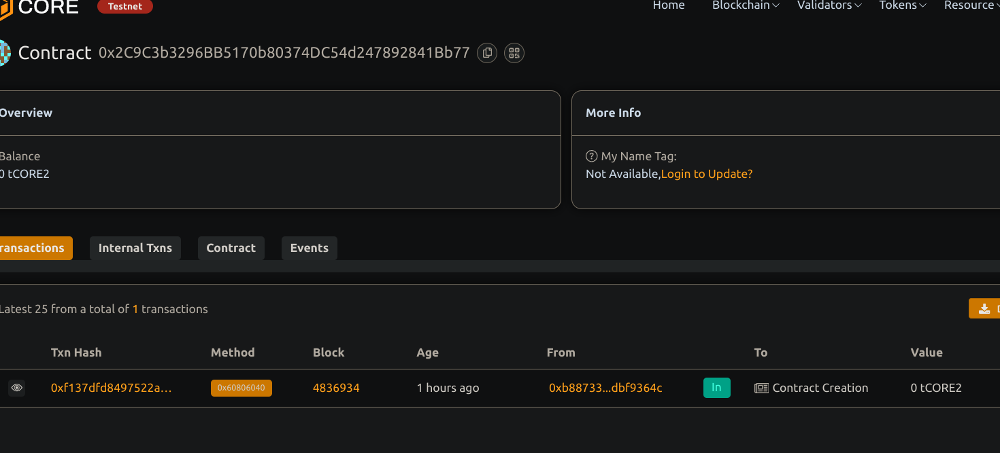

# Digital Certificate Issuance for Online Courses

## Project Description
A decentralized system for issuing, verifying, and revoking digital certificates  for online course. Certificates are represented by hashes stored on-chain, ensuring tamper-proof verification and easy validation.

## Project Vision
To provide a trustworthy and transparent method for online course provider to issue verifiable certificate, empowering student with proof of their accomplishments secured on blockchain.

## Key Features
- Issue certificate with course name, student name, and certificate hash
- Verify certificate authenticity via unique certificate ID.
- Revoke certificates if necessary
- Immutable and transparent certificaterecords on blockchain
- Only contract owner (issuer) can manage certificates

## Future Scope
- Integration with IPFS or decentralized storage for certificate document
- Adding metadata such a grades or completion date
- User-friendly front-end for certificate issuance and verification
- Support for batch issuance of certificate
- Role-based access control for multiple issuer

## Contract details
0x2C9C3b3296BB5170b80374DC54d247892841Bb77
